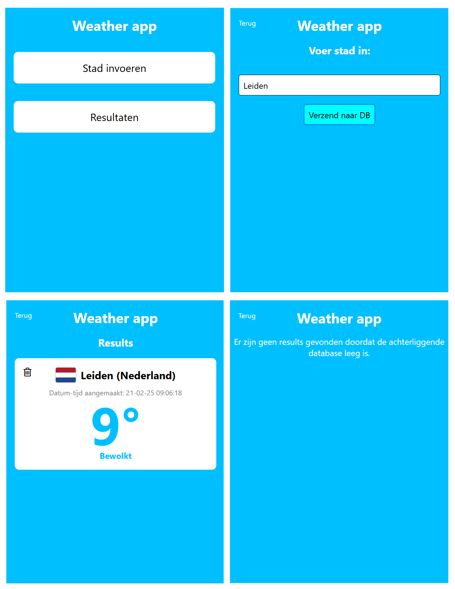

# Weer app met Node.js en MySQL

## Projectomschrijving
Dit Node.js-project is een weer-app waarbij de gebruiker een stad kan invoeren. Wanneer de gebruiker klikt op de 'Verzend naar DB' knop, wordt er een API-call gedaan naar https://openweathermap.org om de actuele weergegevens van die stad op te halen.

Uit de API-response worden een aantal relevante gegevens verzameld (stad, land, temperatuur, weersomschrijving, etc...) die vervolgens in een tabel in een MySQL database worden opgeslagen. De gebruiker kan vervolgens alle opgeslagen weer-registraties in de app bekijken. Ook kan het weer-registraties verwijderen.

## Projectinstallatie
Om dit Node.js project van deze repository te installeren en te runnen, moet je onderstaande stappen uitvoeren:

- Clone de repository door `https://github.com/DustinSchouten/WeatherAppWithNodeJS.git` in een nieuwe map op je lokale machine te runnen en naar deze map te navigeren.

- Installeer alle project dependencies door `npm install` in de root folder te runnen.

- Maak in de root folder een .env bestand aan met daarin onderstaande variabelen:
   - `PORT`
   - `API_BASE_URL`
   - `API_KEY` (Te verkrijgen door een gratis account op openweathermap aan te maken)
   - `DB_NAME`
   - `DB_HOST`
   - `DB_USER`
   - `DB_PASSWORD`

- Maak in MySQL een nieuwe database schema aan en run in de root folder `npm run devMigrate`.

- Run het Node.js project lokaal door `npm run dev` in de root folder te runnen. De webapp kan dan worden bezocht op `http://127.0.0.1:PORT/`.

## Tech stack
| Techniek | Gebruikt voor ... |
| - | - |
| HTML en CSS | Front-end |
| Node.js | Server-side scripting |
| Express.js | Webframework |
| EJS | Template engine |
| MySQL | database voor opslaan weer-registraties |

